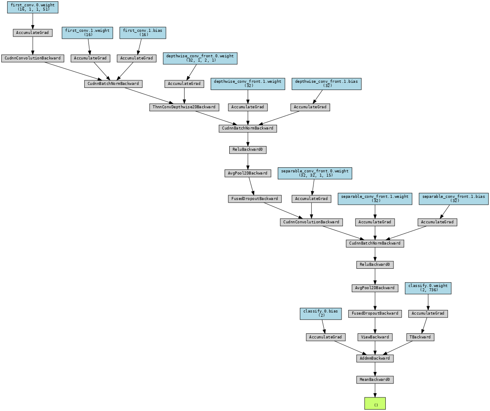
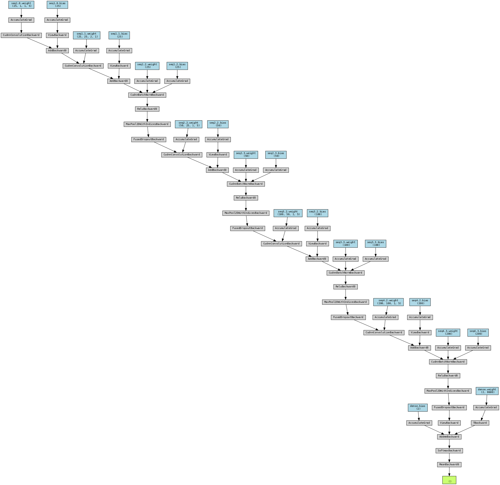
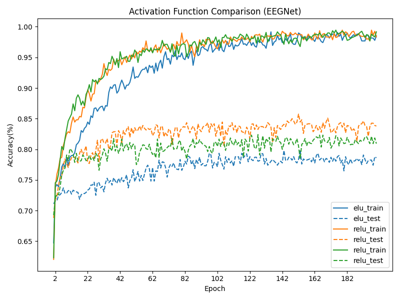
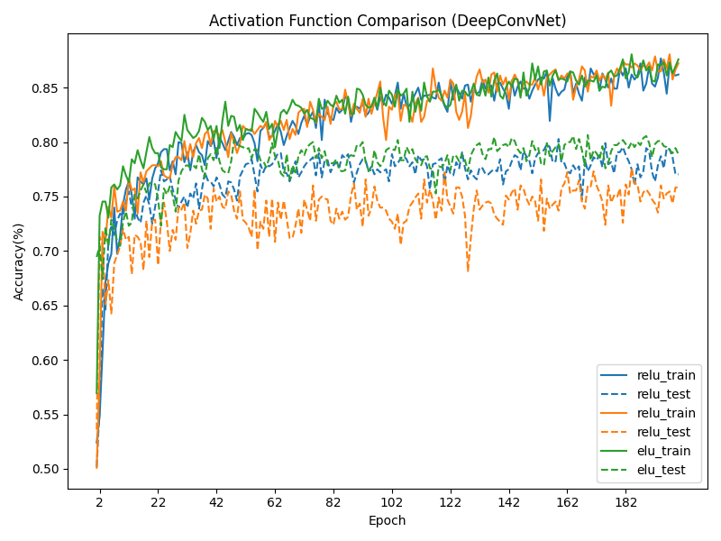
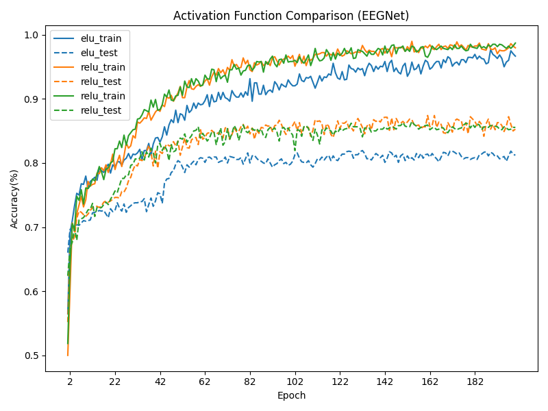
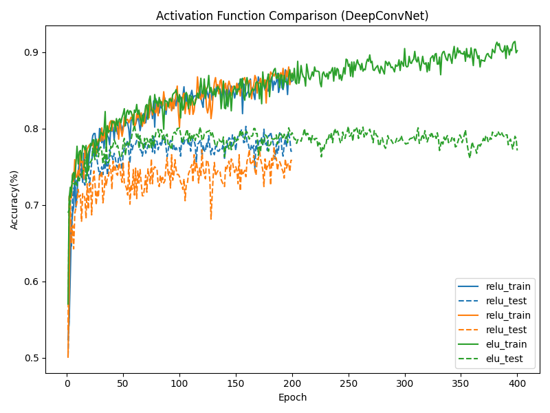
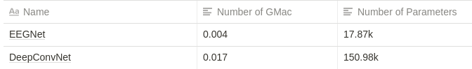

# EEG Classification


## Introduction


本次 LAB 進行 EEG 的資料分類問題。使用的資料集為 BCI Competition III - IIIb Cued motor imagery。實驗 EEGNet 和 DeepConvNet 兩種模型，並搭配不同激勵函數（activation function）的使用。

## Experiment Setup—Models


### 1. EEGNet

下面為 EEGNet 的模型及梯度架構（以激勵函數 ReLU 為例），可以用來觀察模型的梯度傳播路徑。程式碼的撰寫參考作業 spec 的指示。



### 2. DeepConvNet



可以看到 DeepConvNet 比較深，在後面的實驗中也發現 DeepConvNet 需要的訓練時間比較久。

## Experiment Setup—Activation Functions

實驗用的激勵函數有三種：ReLU、Leaky ReLU 和 ELU。

## Experiment Results


### Comparison of Different Activation Functions

這裡固定超參數，實驗兩種模型，觀察不同激勵函數的表現。

```python
# Settings:
Learning rate = 0.01
Batch size = 32
Epochs = 200
Optimizer = Adam
Criterion = Cross-Entropy Loss
```

#### EEGNet



EEGNet + ReLU

- Best test acc: 0.838
- Training complete in 2m 11s

EEGNet + LeakyReLU

- Best test acc: 0.809
- Training complete in 2m 11s

EEGNet + ELU

- Best test acc: 0.799
- Training complete in 2m 13s

#### DeepConvNet



註：橘色是 ReLU，藍色是 Leaky ReLU

DeepConvNet + ReLU

- Best test acc: 0.775926
- Training complete in 7m 50s

DeepConvNet + LeakyReLU

- Best test acc: 0.802778
- Training complete in 7m 49s

DeepConvNet + ELU

- Best test acc: 0.806481
- Training complete in 7m 56s

#### 觀察到的

1. 在 EEGNet，激勵函數效果為 ReLU > LeakyReLU > ELU；但在 DeepConvNet 卻是反過來。雖然不知其原因，但表示不同模型適用的激勵函數不一定相同。
2. DeepConvNet 的訓練普遍較久。EEGNet 依照上面的設定，一次訓練約花費 2 分多鐘，而 DeepConvNet 需要超過 7 分鐘。

### 更多的嘗試

依照前面的設定，各模型和各激勵函數的組合都有基本還不錯的表現。但為了有更好的 accuracy，調整了許多設定，實驗哪種超參數訓練出來的準確率能更上一層樓。由於 EEGNet 的訓練時間較短，較容易多次實驗，因此選擇 EEGNet 作為重點調整參數的實驗對象。經過許多次的嘗試，終於嘗試出一組 accuracy 能大於 87% 的參數：

```python
Learning rate = 0.0025
Batch size = 450
Epochs = 200
Optimizer = Adam (weight decay = 0.0001)
Scheduler = ReduceLROnPlateau(mode='min', patience=15, factor=0.6,
                              min_lr=0.0000001, threshold=1e-4, cooldown=10)
P.S. 這裡 scheduler 效果為：設定成當loss卡住到某個程度就會自動下降學習率
```

EEGNet + ReLU:

- Best test acc: 0.874074
- Training complete in 1m 31s

EEGNet + LeakyReLU:

- Best test acc: 0.864815
- Training complete in 1m 31s

EEGNet + ELU:

- Best test acc: 0.819444
- Training complete in 1m 34s



註：橘色是 ReLU，綠色是 Leaky ReLU


## 其它討論

#### DeepConvNet Training 未飽和問題

從上面 DeepConvNet 200 個 epoch 的訓練結果來看，training accuracy 連 90% 都不到，還有一定的訓練空間（左下圖），可能是因為這個模型複雜度較大。鑑於此現象，其中一個（ELU）重練，換練 400 epoch。結果如右下圖，雖然 training accuracy 上升到滿多的，但 testing accuracy 依然沒有顯著的提升。


註：橘色是 ReLU，藍色是 Leaky ReLU



#### DeepConvNet 和 EEGNet 參數及運算量比較

前面有提到，訓練時發現 EEGNet 練比較快但效果也不錯，所以滿好奇這兩種的模型計算量比較。這裡使用了下面這個 open source 的套件進行模型分析。

[GitHub - sovrasov/flops-counter.pytorch: Flops counter for convolutional networks in pytorch framework](https://github.com/sovrasov/flops-counter.pytorch)

接下來用來描述計算了的單位是 MACs，它是用來描述 multiply-add operations 的數量。測量結果是：



所以很明顯的符合實驗時遇到的狀況，DeepConvNet 需要較大的運算量，並且需要較多時間來訓練。